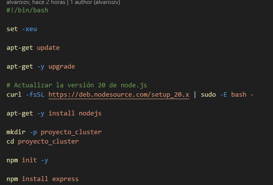
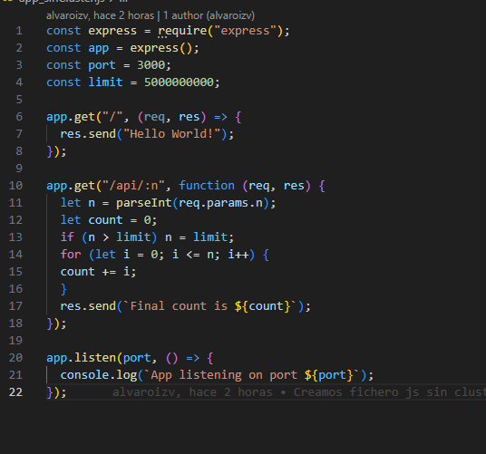
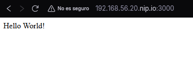
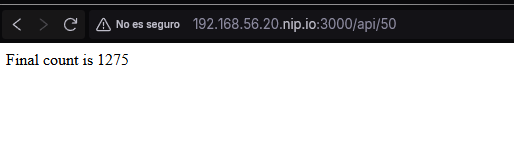
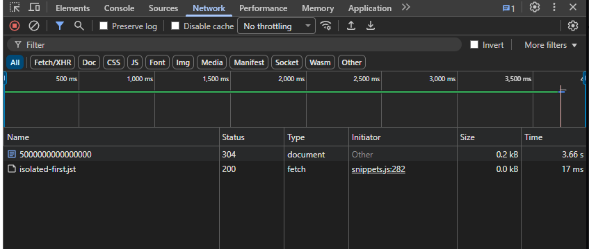
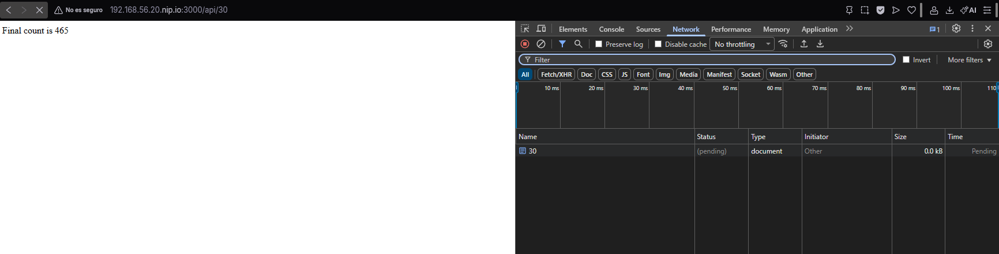
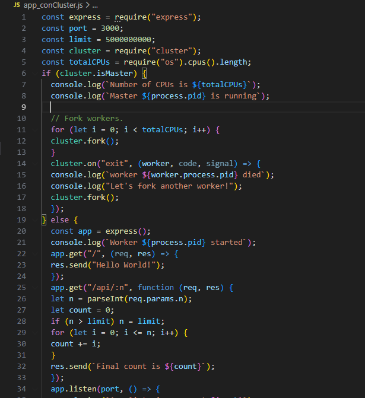
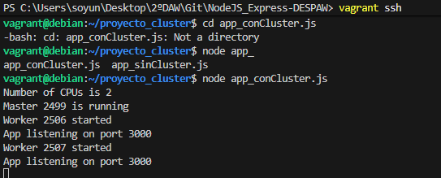
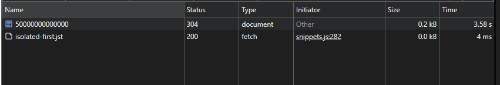
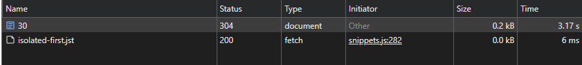

# NodeJS_Express-DESPAW
Despliegue de una Aplicación en Clúster con NodeJS y Express

## Propósito del Proyecto
Proyecto para la asignatura Despliegue de Aplicaciones Web en el cual realizaremos un despliegue con el cluster de NodeJS y Express.También se utilizará el clúster PM2.

## Índice

1. [Herramientas necesarias](#herramientas-necesarias)
   - [Herramientas Internas](#herramientas-internas)
2. [1. Instalación y configuración del proyecto](#1-instalación-y-configuración-del-proyecto)
   - [1.2 Variables de Entorno](#12-variables-de-entorno)
     - [1.2.1 Creación de Espacio de Trabajo](#121-creación-de-espacio-de-trabajo)
     - [1.2.2 Variables de Python y su ejecución](#122-variables-de-python-y-su-ejecución)
   - [1.3 Instalación de paquetes de python (Flask y Gunicorn)](#13-instalacíon-de-paquetes-de-python-flask-y-gunicorn)
3. [2. Archivos .py y despliegue](#2-archivos-py-y-despliegue)
4. [3. Despliegue](#3-despliegue)
   - [3.1 Despliegue con pipenv](#31-despliegue-con-pipenv)
   - [3.2 Despliegue con Gunicorn](#32-despliegue-con-gunicorn)
   - [3.3 Despliegue con Nginx + Gunicorn](#33-despliegue-con-nginx--gunicorn)
5. [4. Tarea Adicional (Proyecto Azure)](#4-tarea-adicional)

---

## Herramientas necesarias

-  **IDE**: En mi caso, Visual Studio Code.
- **Vagrant**
- **VirtualBox**

### Herramientas Internas 
- **NodeJS**
- **Express**
- **PM2**
> **Consejo:** No es obligatorio, pero se recomienda usar un sistema de control de versiones. En mi caso utilicé **Git** y **GitHub** para gestionar el proyecto.

---

## 1. Instalación y configuración del proyecto.
Para comenzar con este proyecto, deberemos crear una máquina virtual con **Vagrant**.

Posteriormente actualizamos e instalamos dichos updates de los paquetes de nuestro SO, en mi caso: ubuntu/jammy64

Lo siguiente será instalar los paquetes necesarios en la provisión en mi caso y para empezar, será nodeJS con el siguiente comando:

```bash
   curl -fsSL https://deb.nodesource.com/setup_20.x | sudo -E bash -
   apt-get -y install nodejs 
```

La primera linea la utilizamos para actualizar nodejs a una versión más moderna (20), ya que sino dará problemas de compatibilidad.

Luego iniciaremos un proyecto en nodejs,previamente creándole una carpeta específica, e instalaremos express :



## 2. Prueba de NodeJS con clúster y sin clúster :

Para ver las ventajas que ofrecen los clústers, primero haremos una prueba sin ellos y luego con ellos :

### 2.1 Prueba sin clúster

Lo primero será crear un fichero JavaScript de prueba llamado app_sinCluster, que tendrá el siguiente contenido :



Una vez creado, deberemos copiarlo a nuestra Máquina Virtual con la siguiente instrucción :

```bash
   cp /vagrant/app_sinCluster.js . 
```

(Utilizamos . ya que previamente nos hemos movido con cd a la carpeta del proyecto)

Una vez dentro de la máquina virtual por **vagrant ssh**, realizaremos esta serie de comandos para ejecutar nuestro fichero JavaScript:


Si hemos tenido éxito, nos saldrá la linea inferior (App listening on port 3000). Si accedemos a dicho puerto desde nuestro navegador veremos esta página web :



Por otro lado, si accedemos a la ruta /api/n con un número pequeño, obtenemos un resultado inmediato:



Ahora, si accedemos con un número grande veremos que tarda en responder (esto se debe a la carga del servicio al tener solo 1 hebra disponible) :



También si de mientras está cargando el número grande le pedimos uno pequqeño, se quedará en espera para responder :



### 2.2 Prueba con clúster

Primero crearemos un fichero JavaScript con las siguientes instrucciones, para probar el clúster :



Luego lo copiaremos a la Máquina Virtual con la siguiente instrucción :

```bash
   cp /vagrant/app_conCluster.js . 
```

Despúes de reiniciar la provisión, ejecutamos el fichero JS con clúster y obtendremos esta salida si todo ha ido bien :



Ahora repetiremos la última prueba anteriormente realizada, donde ejecutaremos 2 ventanas, una con un número grande y otra con uno pequeño :





Vemos que por poco, pero acelera el tiempo que tarda en cargar dichas operaciones, esto se debe al **balanceo de carga**.

## 3. Métricas de Rendimiento

Con el paquete **loadtest** realizaremos pruebas de carga, para comprobar como manejan una gran cantidad de peticiones de peticiones entrantes.

Para instalar dicho paquete utilizamos la siguiente instrucción :

```bash
   npm install -g loadtest 
```